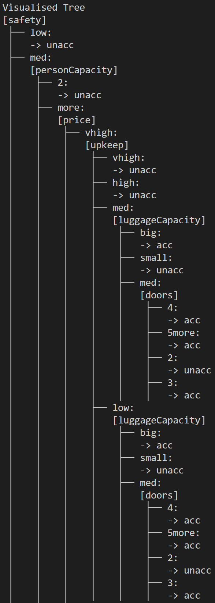

# Decision Learning Tree

## Overview

This project implements a decision tree classifier in Python using entropy and information gain. It reads a car evaluation dataset, splits the data into training and testing sets, recursively builds a decision tree, prints the resulting tree structure, and predicts classifications for test records.

This project was developed for a university intelligent systems assignment to demonstrate how a decision tree can be implemented from scratch rather than relying on a prebuilt library.

## Skills Demonstrated

- Designing a recursive algorithm
- Reading and processing data from CSV files
- Calculating entropy and information gain
- Creating a modular program structure in Python

## Key Features

- Reads CSV data into Python objects
- Calculates entropy and information gain
- Selects the best attribute for each recursive split
- Recursively builds a tree until stopping conditions are reached
- Predicts classifications for unseen rows
- Prints a readable tree representation to the terminal

## Tech Stack

- Python
- CSV file handling
- Decision tree logic
- Entropy / information gain

## File Guide

- `main.py` - loads data, splits dataset, builds tree, and prints predictions
- `fileReader.py` - reads CSV data into objects and extracts column values
- `entropy.py` - calculates entropy, information gain, and classifier counts
- `searchTree.py` - builds and prints tree, predicts classifiers
- `classes.py` - defines Car and TreeNode classes
- `constants.py` - contains training split percentage and number of classifier constants

## How to Run

This program only uses standard Python libraries and does not require external packages.
All files and dataset must be within the same folder.

``` batch
python main.py
```

## Example Output of Tree Visualisation



## Limitations

- Designed for the provided categorical car evaluation dataset
- Assumes clean input data and does not perform preprocessing
- Uses a simple random shuffle to split train/test datasets

## More Projects

More projects are available in my [portfolio repository](https://github.com/JohnMartinMacLeod/data-portfolio)
